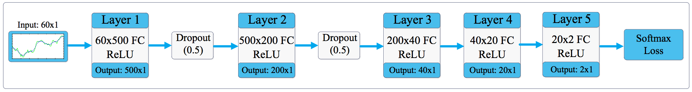

# Financial Time Series Prediction Using Deep Learning

This repository contains an implementation of [Financial Time Series Prediction Using Deep Learning](https://arxiv.org/abs/1711.04174), by Ariel Navon and Yosi Keller.

## Paper Abstract
```
In this work we present a data-driven end-to-end Deep Learning approach for time series prediction,
applied to financial time series. A Deep Learning scheme is derived to predict the temporal
trends of stocks and ETFs in NYSE or NASDAQ. Our approach is based on a neural network (NN)
that is applied to raw financial data inputs, and is trained to predict the temporal trends of 
stocks and ETFs. In order to handle commission-based trading, we derive an investment strategy 
that utilizes the probabilistic outputs of the NN, and optimizes the average return. 
The proposed scheme is shown to provide statistically significant accurate predictions of 
financial market trends, and the investment strategy is shown to be profitable under 
this challenging setup. The performance compares favorably with contemporary benchmarks 
along two-years of back-testing.
```

### Tools & Data

For building the neural network, I used [PyTorch](pytorch.org). Network architecture:


Due to financial constraints, instead of using the [QuantQuote](https://quantquote.com/historical-stock-data) market data mentioned in the paper, data pulled from the [IEX Trading API](https://iextrading.com/developer/docs/) was used to train and test the model.
